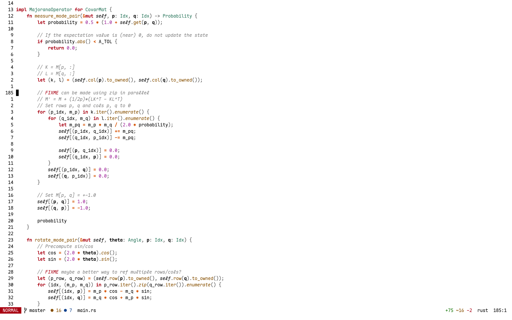

# Whiteboard.nvim
An attempt at a pleasant and highly readable colorscheme!

## Installation and Usage
You can install this colorscheme in a similar manner to installing a plugin.

## Plugin support
Most plugins should work out of the box. Additionally, the colorscheme has highlights for:
- Vim Diagnostics
- Vim LSP
- Nvim-Treesitter
- Telescope
- Nvim-Notify
- Nvim-Cmp
- NvimTree
- Neogit
- Gitsigns
- Hydra
- Flash

Don't hesitate to open a PR if you see a plugin that should have explicit highlights. 

## Inspirations
- [oxocarbon.nvim](https://github.com/nyoom-engineering/oxocarbon.nvim) For which the source of this theme is based off of!
- [melange.nvim](https://github.com/savq/melange-nvim) I found myself agreeing with most of its design choices regarding color choice and usage of warm/cold colors.
- [zenbones.nvim](https://github.com/zenbones-theme/zenbones.nvim?tab=readme-ov-file)
- [jellybeans.nvim](https://github.com/WTFox/jellybeans.nvim) 

